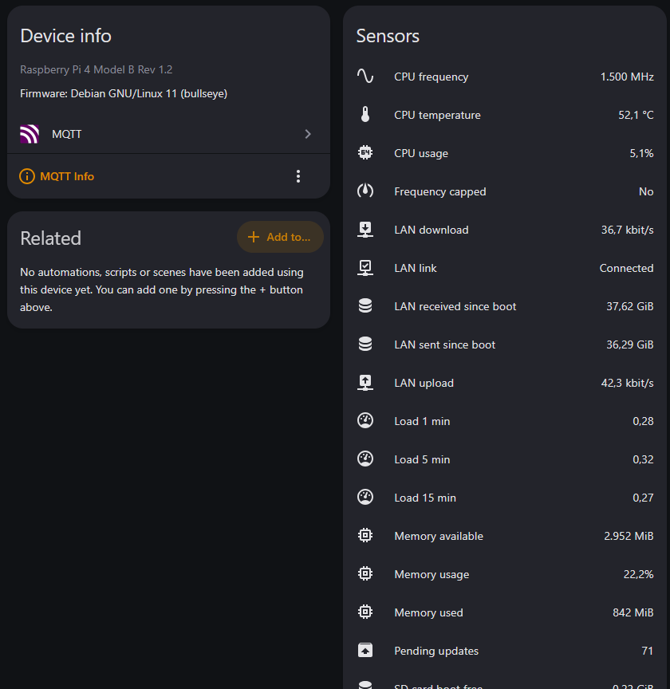
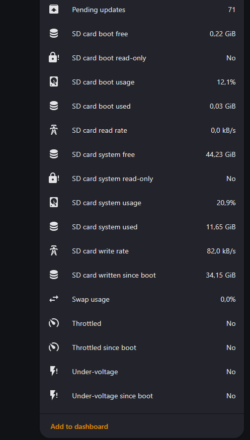
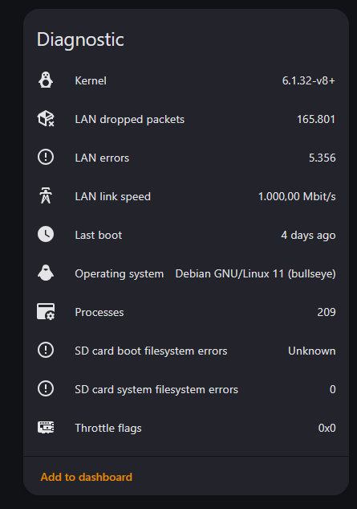

# host-metrics-mqtt


A small Python service that publishes Linux host metrics to **Home Assistant** over
**MQTT**. Entities are created automatically via MQTT discovery and grouped as one
device per host — no YAML in Home Assistant needed.

It runs on any Linux machine. On a **Raspberry Pi** it additionally reports
under-voltage and throttling, and it watches the typical symptoms of a failing SD card.



<details>
<summary>More screenshots</summary>

| All sensors | Diagnostic |
|---|---|
|  |  |

</details>

## Features

- **Zero configuration in Home Assistant** — entities appear under
  *Settings → Devices & services → MQTT*
- **One YAML config file**, every metric group can be switched off
- **Friendly names** for disks, block devices and interfaces (`SD card system` instead of `/`)
- **Availability via Last Will** — entities turn *unavailable* when the host or the service goes down
- **Survives Home Assistant restarts** — re-announces itself on `homeassistant/status`
- **Runs unprivileged** as a hardened systemd service
- **English and German** entity names
- Works with **paho-mqtt 1.x and 2.x** and **Python ≥ 3.7** (Debian 11 and later)

## Metrics

| Group | Entities |
|---|---|
| CPU | usage %, temperature, frequency, load 1/5/15 |
| Memory | RAM usage %, used / available MiB, swap usage % |
| Disks (per mount point) | usage %, used / free GiB, read-only, ext4 error count |
| Block devices (per device) | read / write rate, written since boot, eMMC wear level and pre-EOL state (if reported) |
| Network (per interface) | download / upload, received / sent since boot, link, link speed, errors, dropped packets |
| Raspberry Pi | under-voltage, throttled, frequency capped (now and since boot), raw flags |
| System | processes, last boot, kernel, operating system, pending apt updates |

Yes/no values (*Throttled*, *Under-voltage*, *read-only*) are published as sensors
with the states **Yes / No**. Set `general.flags: binary` to get binary sensors
instead — Home Assistant then shows them as *OK / Problem*.

### About SD card health

SD cards have no SMART, so their remaining lifetime cannot be read. What this tool
watches instead are the symptoms of a dying card:

- **Read-only filesystem** — after I/O errors the kernel remounts the filesystem
  read-only. This is the most common sign that a card is failing.
- **ext4 error count** from `/sys/fs/ext4/<partition>/errors_count`
- **Written since boot** and the **write rate**, to see which workloads wear the card

eMMC modules and some industrial cards expose `life_time` / `pre_eol_info`. If those
files exist, the matching entities are created automatically.

### About under-voltage

The Raspberry Pi firmware keeps track of power problems itself (the same value
`vcgencmd get_throttled` shows). The script reads it from
`/sys/devices/platform/soc/soc:firmware/get_throttled` and falls back to
`vcgencmd`. The *since boot* flags also catch short dips that a 30-second interval
would miss.

## Requirements

- Linux with systemd
- Python ≥ 3.7 with `psutil`, `PyYAML` and `paho-mqtt`
- An MQTT broker, e.g. the Mosquitto app in Home Assistant or a standalone Mosquitto
- The **MQTT integration** set up in Home Assistant
  (*Settings → Devices & services → Add integration → MQTT*). A running broker alone
  is not enough — without the integration no entities show up. Discovery is enabled
  by default.

## Step 1: Create an MQTT user

The service logs in to the broker with its own user. Give every host its own user
instead of sharing one — you can then revoke a single host and see in the broker log
who connects.

**Mosquitto app in Home Assistant:** add the user under `logins` in the app
configuration (*Settings → Apps → Mosquitto broker → Configuration*, ⋮ → *Edit in YAML*;
called *Add-ons* in older versions) and restart the app:

```yaml
logins:
  - username: myhost
    password: secret
```

**Standalone Mosquitto:** add the user to the file set as `password_file` in your
`mosquitto.conf` and reload the broker:

```bash
sudo mosquitto_passwd /etc/mosquitto/passwd myhost
sudo systemctl reload mosquitto
```

## Step 2: Installation

On Debian, Ubuntu or Raspberry Pi OS:

```bash
git clone https://github.com/Kyobinoyo/host-metrics-mqtt.git
cd host-metrics-mqtt

sudo apt install python3-psutil python3-yaml python3-paho-mqtt
sudo useradd --system --no-create-home --shell /usr/sbin/nologin host-metrics

sudo install -d -m 755 /opt/host-metrics-mqtt
sudo install -m 755 host-metrics-mqtt.py /opt/host-metrics-mqtt/

sudo install -d -m 700 /etc/host-metrics-mqtt
sudo install -m 600 config.example.yaml /etc/host-metrics-mqtt/config.yaml
sudo nano /etc/host-metrics-mqtt/config.yaml
```

In the config, set at least the broker address and the MQTT user from step 1 —
see [Configuration](#configuration) for examples.

Test the configuration — this prints what would be sent, without connecting:

```bash
sudo python3 /opt/host-metrics-mqtt/host-metrics-mqtt.py --config /etc/host-metrics-mqtt/config.yaml --dry-run
```

Install and start the service:

```bash
sudo install -m 644 host-metrics-mqtt.service /etc/systemd/system/
sudo systemctl daemon-reload
sudo systemctl enable --now host-metrics-mqtt
journalctl -u host-metrics-mqtt -f
```

The log should show `connected to <broker>` and `discovery published (… entities)`.

## Configuration

All options with their defaults are listed in [`config.example.yaml`](config.example.yaml).
Unknown keys and wrong types stop the program with a clear message instead of being
silently ignored.

**Example: Linux server or VM**

```yaml
mqtt:
  host: 192.168.1.10
  username: myhost
  password: 'secret'

device:
  name: My Server

metrics:
  disks:
    /: System disk
    /mnt/data: Data disk
  network:
    eth0: LAN
  block_devices:
    sda: System SSD
```

Find your mount points with `df -h`, interfaces with `ip -br link` and block devices
with `lsblk -d`.

**Example: Raspberry Pi with SD card** (current Raspberry Pi OS)

```yaml
mqtt:
  host: 192.168.1.10
  username: mypi
  password: 'secret'

device:
  name: My Pi

metrics:
  disks:
    /: SD card system
    /boot/firmware: SD card boot
  network:
    eth0: LAN
  block_devices:
    mmcblk0: SD card
```

On Raspberry Pi OS 11 (bullseye) and older the boot partition is mounted at `/boot`
instead of `/boot/firmware`.

`disks`, `network` and `block_devices` take either a list (`[/, /boot]`) or a mapping
to a label. Without a label, `/` is called *Root filesystem*, `/boot` *Boot partition*
and `mmcblk0` *SD card*.

**Password:** use single quotes. In double quotes YAML treats a backslash as an escape
character; a `'` inside single quotes is written as `''`.

**Language:** `general.language: en` (default) or `de` changes entity names and the
yes/no values.

## Security

- The service runs as the unprivileged user `host-metrics`, with `NoNewPrivileges`,
  `PrivateTmp`, `ProtectHome` and a memory limit.
- The config stays root-only on disk. Before each start systemd copies it (as root, the
  `+` in `ExecStartPre=`) into `/run/host-metrics-mqtt/`, which only the service user
  can read. `LoadCredential=` is not used because it fails with systemd 247 (Debian 11).
- `ProtectSystem=` is deliberately not set: it would make `/` read-only inside the
  service namespace and break the read-only detection.

## MQTT topics

| Topic | Content |
|---|---|
| `host-metrics/<node_id>/state` | JSON with all values |
| `host-metrics/<node_id>/availability` | `online` / `offline` (retained, Last Will) |
| `homeassistant/<component>/<node_id>/<key>/config` | discovery (retained) |

## Removing a host

```bash
sudo systemctl disable --now host-metrics-mqtt
sudo python3 /opt/host-metrics-mqtt/host-metrics-mqtt.py --config /etc/host-metrics-mqtt/config.yaml --remove
```

`--remove` deletes the retained discovery messages, and Home Assistant then removes
the entities.

## Notes

- Keep `node_id` stable. It is part of every `unique_id`; changing it creates new entities.
- Changing a disk path or a device name also creates new entities, because the
  `unique_id` is derived from it. Run `--remove` with the **old** config first.
- Home Assistant remembers deleted entities: re-created entities get their previous
  entity IDs back, even if the names changed. Rename entity IDs in Home Assistant if needed.
- Rates are averages over one interval.
- *Pending updates* only counts; it does not run `apt update` (the `apt-daily.timer` does).

## Tested on

- Raspberry Pi 4 Model B, Raspberry Pi OS 11 (bullseye), systemd 247
- paho-mqtt 1.5.1, 1.6.1 and 2.1

## Feedback

Bugs and ideas are welcome as
[issues](https://github.com/Kyobinoyo/host-metrics-mqtt/issues).

## Credits

This project was created with the help of **[Claude](https://claude.ai)** by
Anthropic — from the first draft through the systemd hardening to this README. The
code was reviewed, tested and is running in a real homelab.

## License

[GNU General Public License v3.0 or later](LICENSE) — you may use, modify and share
this project; modified versions you distribute must be released under the same
license.
